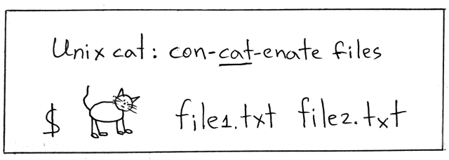

# A simple Unix cat implementation



More about Unix cat: https://en.wikipedia.org/wiki/Cat_(Unix)

Rules of engagement:

1. Limit input to one [text file](helloworld.txt) in ASCII
2. Read one character (one byte) at a time until EOF
   - If your language explicitely supports a way to check for the EOF condition, use that instead of an iterator/text scanner/etc.
3. Print each character to the standard output
4. Error checks can be omitted to simplify the implementation
5. Make sure your code works :)


## C version using the standard I/O library

```C
#include <stdio.h>

int main(int argc, char *argv[])
{
  FILE *fp;
  int c;

  if ((fp = fopen(*++argv, "r")) == NULL) {
    printf("scat: can't open %s\n", *argv);
    return 1;
  }

  while ((c = getc(fp)) != EOF)
    putc(c, stdout);

  fclose(fp);

  return 0;
}
```

``` shell
$ gcc -o scat scat.c

$ ./scat helloworld.txt
Hello world!
```

## C version using systems calls (Unix I/O routines)

```C
#include <sys/types.h>
#include <sys/stat.h>
#include <fcntl.h>
#include <unistd.h>

int main(int argc, char *argv[])
{
  int fd;
  char c;

  fd = open(argv[1], O_RDONLY, 0);

  while (read(fd, &c, 1) != 0)
    write(STDOUT_FILENO, &c, 1);

  return 0;
}
```

``` shell
$ gcc -o scat scat.c

$ ./scat helloworld.txt
Hello world!
```

## Python (versions 3.0.x - 3.7.x)

``` python
import sys

with open(sys.argv[1]) as fin:
    while True:
        c = fin.read(1) # read max 1 char
        if c == '':     # EOF
            break
        print(c, end='')
```

``` shell
$ python scat.py helloworld.txt
Hello world!
```

## Python 3.8+ (using the walrus operator)

``` python
import sys

with open(sys.argv[1]) as fin:
    while (c := fin.read(1)) != '':  # read max 1 char at a time until EOF
        print(c, end='')

```

``` shell
$ python3.8 scat.py helloworld.txt
Hello world!
```

## Go

``` go
package main

import (
	"fmt"
	"os"
	"io"
)

func main() {
	file, err := os.Open(os.Args[1])
	if err != nil {
		fmt.Fprintf(os.Stderr, "scat: %v\n", err)
		os.Exit(1)
	}

	buffer := make([]byte, 1)  // 1-byte buffer
	for {
		bytesread, err := file.Read(buffer)
		if err == io.EOF {
			break
		}
		fmt.Print(string(buffer[:bytesread]))
	}
	file.Close()
}
```

``` shell
$ go run scat.go helloworld.txt
Hello world!
```


## JavaScript (node.js)

``` javascript
const fs = require('fs');
const process = require('process');

const fileName = process.argv[2];

var readable = fs.createReadStream(fileName, {
  encoding: 'utf8',
  fd: null,
});

readable.on('readable', function() {
  var chunk;
  while ((chunk = readable.read(1)) !== null) {
    process.stdout.write(chunk); /* chunk is one byte */
  }
});

readable.on('end', () => {
  console.log('\nEOF: There will be no more data.');
});

```

``` shell
$ node mcat.js helloworld.txt
Hello world!

EOF: There will be no more data.
```

## Scheme (GNU Guile)

``` scheme
(import (rnrs))
(define (cat_file path)
 (call-with-input-file path
   (lambda (input-port)
     (let loop ((x (read-char input-port)))
	   (when (not (eof-object? x)) (begin (display x) (loop (read-char input-port))))))))
(cat_file (car (cdr (command-line))))
```

``` shell
$ guile --no-auto-compile cat.scm helloworld.txt
Hello world!
```

Submit a PR to add your implementation.

Rules of engagement:

1. Limit input to one [text file](helloworld.txt) in ASCII
2. Read one character (one byte) at a time until EOF
   - If your language explicitely supports a way to check for the EOF condition, use that instead of an iterator/text scanner/etc.
3. Print each character to the standard output
4. Error checks can be omitted to simplify the implementation
5. Make sure your code works :)
